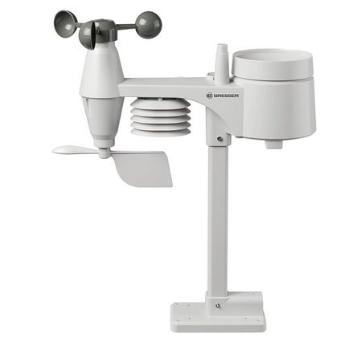

# Esp32 D1 Mini Lectura Bresser 6 en uno RF 868mhz con receptor cc1101

## Description

Esté proyecto permite leer los datos de una estación meteorológica de 868Mhz con un ESP32 D1 Mini y un módulo CC1101.

El modelo de la estación es Bresser 6-in-1, pero debería funcionar con cualquier otras estaciones como la de 5-in1 cambiando una definición.

Utilizando un receptor RF a 868mhz capturo los datos que emite la estación meteorológica
para decodificarlos, procesarlos y subirlos a una API propia.

Sitio web del autor: [https://raupulus.dev](https://raupulus.dev)

## Preparar el código

Tenemos que copiar el archivo de ejemplo api.cpp.example al mismo nivel
de directorio y llamarlo simplemente api.cpp modificando posteriormente
las variables privadas de acceso a nuestro router wireless personal y la api
que tengamos en uso.

En caso de no tener o no querer utilizarlo, establecer la variable
upload_to_api en false y las demás variables vacías tal como están en el
archivo de ejemplo actualmente.

Repository [https://gitlab.com/raupulus/esp32-weatherstation-bresser-read-868mhz-cc1101](https://gitlab.com/raupulus/esp32-weatherstation-bresser-read-868mhz-cc1101)

## Imágenes del Hardware

  
  
  
  

## Diseño 3D Propio

Para complementar el proyecto he creado un diseño personalizado
simulando un poco el tiempo con nube/sol/rayo y la estación detrás a un
nivel muy minimalista pero queda algo más visual que una simple caja cuadrada
en mi opinión.

Si te interesa, te dejo los enlaces para que lo puedas descargar y utilizar
en tu proyecto también.

- [Thingiverse](https://www.thingiverse.com/thing:6800139)
- [Printables](https://www.printables.com/model/1042119-esp32-d1-mini-project-box-bresser-6-in-one-rf-868m)
- [Makerworld](https://makerworld.com/es/models/708896#profileId-639168)

Adicionalmente tienes algunas imágenes del modelo con el proyecto finalizado
a continuación.

  
  
  
  
  
  
  
  
  
  
  
  
  
  
  

## Esquemas de Pines

### ESP32 D1 Mini

| ESP32 D1 Mini | CC1101 |
| ------------- | ------ |
| 3V3           | VCC    |
| GND           | GND    |
| D23           | MOSI   |
| D18           | SCK    |
| D19           | MISO   |
| D27           | GDO2   |
| D26           | GDO0   |
| D5            | CSN    |

## Authors and acknowledgment

El proyecto actual lo ha implementado @raupulus @fryntiz Raúl Caro Pastorino basándose en el proyecto de @matthias-bs Matthias Bresser (https://github.com/matthias-bs/BresserWeatherSensorReceiver)

Usando el ejemplo "BresserWeatherSensorCallback" como base para el desarrollo.

## License

MIT License

## Project status

El proyecto es funcional, pero se puede mejorar y añadir funcionalidades.

Cosas pendientes o muy mejorables:

- Externalizar la parte de los sensores a una librería
- Dejar en un hilo/cpu la parte de la recepción de datos y en otro la parte de la API
- Entrar en modo sleep y despertar con interrupción para ahorrar batería, la interrupción debería ser validando el id de la estación y el checksum.
